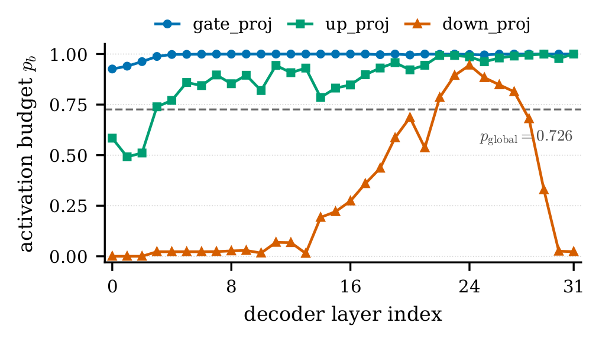

# GaDRA: Learning When Not to Apply LoRA in Replay-Free Continual Pre-Training

[](LICENSE)
[](pyproject.toml)
[](https://github.com/huggingface/peft)
[](https://github.com/GlycerinLOL/GaDRA/actions/workflows/ci.yml)

Official implementation of **GaDRA** (**Ga**ted **D**ual-conditioned **R**esidual **A**dapter), a HuggingFace
[`peft`](https://github.com/huggingface/peft)-native PEFT method that learns *when **not** to apply* a LoRA
update. GaDRA is model-agnostic (any HF `*ForCausalLM` via `target_modules` name-matching) and drops into the
standard peft API — swap `LoraConfig` for `GaDRAConfig`.

> **TL;DR** — Replay-free continual pre-training (CPT) must absorb post-cutoff text without forgetting prior
> skills. Always-on LoRA applies its residual at *every* token, indiscriminately. GaDRA adds a **per-position
> hard binary gate** over the LoRA residual, **dual-conditioned** on the frozen module output `y⁰` and the
> candidate residual `δ`, trained jointly with the LoRA factors via a Gumbel straight-through estimator. On
> replay-free CPT of Llama-3.1-8B-Instruct, GaDRA **matches always-on LoRA on the target corpus while
> substantially improving retention** of math, code, and time-sensitive factual QA — the best overall
> target–retention trade-off among compared LoRA-CPT preservation methods.

## Approach

<p align="center">
  
</p>
<p align="center"><em>One adapted MLP projection. A per-position hard gate <code>γₜ ∈ {0,1}</code>, dual-conditioned on the
frozen base output <code>y⁰</code> and the LoRA residual <code>δ</code>, decides whether to apply the residual;
when it closes (<code>γₜ=0</code>) the module output is bit-identical to the frozen base.</em></p>

For an adapted module at sequence position `t`, standard LoRA is always-on: `yₜ = yₜ⁰ + δₜ`, with
`δₜ = α·B·A·xₜ`. GaDRA inserts a per-position gate `γₜ ∈ {0,1}`:

```
yₜ = yₜ⁰ + γₜ · δₜ          γₜ = 1[ σ(zₜ) > 0.5 ]        zₜ = g([yₜ⁰ ; δₜ])
```

- **Dual-conditioned gate** — the router `g` sees both the preserved behavior `yₜ⁰` and the proposed change
  `δₜ`, so it can tell a needed correction from a harmful perturbation. (`GaDRA-Mono` conditions on `δₜ` only.)
- **Hard binary commitment** — when the gate closes (`γₜ=0`) the module output is *bit-identical* to the frozen
  base. Trained with a Gumbel-sigmoid straight-through estimator (`τ=1`, no annealing); deterministic
  `1[σ(z)>0.5]` at inference. (`soft` variant uses a continuous `γ∈[0,1]`.)
- **Activation budget, not capacity** — the analysis shows GaDRA's gain comes from a learned *per-(layer×module)
  activation budget* (which modules stay active, and how often), not from smaller LoRA updates or token-level
  routing. A single global budget degrades acquisition.

GaDRA is **non-mergeable** by design: the gate is per-token and input-dependent, so the adapter cannot be folded
into the base weights.

| Variant | `router_conditioning` | `gate` |
|---|---|---|
| **GaDRA** | `dual` | `hard` |
| GaDRA-Mono | `mono` | `hard` |
| GaDRA-Soft | `dual` | `soft` |
| GaDRA-Mono-Soft | `mono` | `soft` |

## Results

Replay-free CPT of **Llama-3.1-8B-Instruct** (`r=512, α=1`) on two 2024 news corpora, averaged across corpora as
mean improvement over the always-on **LoRA** anchor: `Δ_tgt` = target acquisition (BBC QA / CCQA), `Δ_ret` =
retention (GSM8K / MBPP / TiEBe), `Overall = (Δ_tgt + Δ_ret) / 2`.

| Method | Δ target | Δ retention | **Overall** |
|---|:---:|:---:|:---:|
| LoRA (always-on, anchor) | — | — | — |
| MiLoRA | +0.47 | −15.81 | −7.67 |
| LoRA-Null | −3.05 | −21.81 | −12.43 |
| CLoRA | −3.43 | +6.81 | +1.69 |
| GaDRA-Mono | −5.15 | +11.56 | +3.21 |
| **GaDRA** | **−1.48** | **+11.08** | **+4.80** |

GaDRA stays at near-parity on the target corpus (Δ_tgt −1.48) while recovering retention that always-on LoRA
loses (Δ_ret +11.08), for the **best overall trade-off**. A **Qwen3-8B** cross-architecture probe shows the same
direction (Overall **+4.73**). See the paper for the full per-corpus tables, the dual×hard ablation, and the
gate-intervention analysis.

<p align="center">
  
</p>
<p align="center"><em>The gain comes from a learned per-(layer×module) <strong>activation budget</strong>: <code>gate_proj</code>
stays active (≈0.99) and <code>up_proj</code> high (≈0.88), while most <code>down_proj</code> blocks stay closed
(≈0.31). Flattening this to a single global budget degrades target acquisition.</em></p>

## Installation

**Use the method** (pip — pulls `peft==0.16.0`, `transformers==4.53.3`, nothing else):

```bash
pip install gadra
```

**Reproduce the paper** — the training + inference workflow is managed with [uv](https://docs.astral.sh/uv/)
(one environment for single- and multi-GPU; they install the same packages and differ only in the launch):

```bash
curl -LsSf https://astral.sh/uv/install.sh | sh        # one-time
git clone https://github.com/GlycerinLOL/GaDRA && cd GaDRA
uv sync --group gpu                                     # cu124 torch + prebuilt flash-attn + deepspeed (no compile)
huggingface-cli login                                  # gated base model
```

**Prerequisites** uv cannot install: an NVIDIA GPU with **driver ≥ 525.60.13** (the env uses the CUDA 12.4
runtime bundled in the torch wheel), Linux x86_64 (glibc ≥ 2.17), and Hub access to the gated
`meta-llama/Llama-3.1-8B-Instruct`. See the [FAQ](docs/FAQ.md) for common install issues.

## Quick start

```python
import gadra                                   # side-effect: registers the "gadra" method with peft
from gadra import GaDRAConfig
from peft import get_peft_model
from transformers import AutoModelForCausalLM, Trainer

base = AutoModelForCausalLM.from_pretrained("meta-llama/Llama-3.1-8B-Instruct")
cfg = GaDRAConfig(
    r=512, lora_alpha=1, lora_dropout=0.05,
    target_modules=["up_proj", "gate_proj", "down_proj"],
    router_conditioning="dual",                # "dual" = GaDRA | "mono" = GaDRA-Mono
    gate="hard",                               # "hard" = Gumbel-STE | "soft"
    task_type="CAUSAL_LM",
)
model = get_peft_model(base, cfg)
Trainer(model=model, args=..., train_dataset=...).train()   # stock Trainer, plain LM loss — no custom loop
model.save_pretrained("out/")
```

Load and generate with the standard peft API (the gate stays attached — non-mergeable):

```python
from peft import PeftModel
model = PeftModel.from_pretrained(base, "out/")
model.generate(...)
```

## Reproducing the paper

The reproduction tooling lives under [`examples/`](examples/) (repo-only — never shipped in the wheel). Data is
**not** shipped: supply your own JSONL and point the config at it (see the
[Data formats](examples/README.md) and the [FAQ](docs/FAQ.md)).

```bash
# Train — GaDRA CPT (single GPU). Variants: --override router_conditioning=mono | --override gate=soft
uv run python -m examples.train --config examples/config/train.yaml

# Train — multi-GPU (the paper's setup: accelerate + DeepSpeed ZeRO-2)
uv run accelerate launch --num_processes <N_GPUS> \
    --config_file examples/config/deepspeed_zero2.yaml \
    -m examples.train --config examples/config/train.yaml

# LoRA baseline (stock peft.LoraConfig — the always-on anchor)
uv run python -m examples.train_lora_baseline --config examples/config/train_lora.yaml

# Evaluate — deterministic, no key:  task: qa | gsm8k | mbpp  (MBPP needs HF_ALLOW_CODE_EVAL=1)
uv run python -m examples.inference --config examples/config/inference.yaml

# Evaluate — GPT-judged "Correct %":  task: bbcqa | tiebe   (key from the environment, never the repo)
export OPENAI_API_KEY=sk-...
uv run python -m examples.inference --config examples/config/inference.yaml --override task=bbcqa
```

The eval derives each sample's prompt / reference / judge inputs exactly as the research harness does, so the
paper's **raw** eval files work directly. Same tokenizer + chat template + greedy params ⇒ the **deterministic**
metrics (QA char-F1/EM, GSM8K EM, MBPP pass@1) reproduce bit-for-bit; **BBC-QA / TiEBe** use the verbatim GPT
judge and are method-equivalent (not bit-exact, since they call OpenAI).

**SLURM** (offline compute nodes): set `GADRA_REPO`, pre-sync once on the login node
(`uv sync --group gpu --locked`), then `sbatch examples/slurm/{train,inference}.slurm`. On an account/partition
cluster set `export SBATCH_ACCOUNT=... SBATCH_PARTITION=...` once.

## Repository structure

```
src/gadra/             # the pip-installable METHOD ONLY (zero data/eval deps)
  config.py            #   GaDRAConfig (LoraConfig-idiomatic)
  layer.py / gate.py   #   GaDRALinear + the gate (Gumbel-STE / softplus)
  model.py / _register.py  # BaseTuner + register_peft_method wiring
examples/              # repo-only reproduction tooling (NOT in the wheel)
  train.py / inference.py / train_lora_baseline.py   # config-driven entries
  processing.py / evaluation.py / convert.py         # data / scorers+judge / legacy-ckpt converter
  config/              #   run-configs + DeepSpeed ZeRO-2 + chat template
  slurm/               #   uv SLURM wrappers
tests/ · examples/tests/   # method purity/parity gates + reproduction parity goldens
docs/DESIGN.md         # architecture mapping + numeric-parity protocol
```

Convert a legacy research-code checkpoint (`peft_config.json` + `peft_model.bin`) to the peft format with the
repo-only converter: `from examples.convert import convert_checkpoint`.

## Citation

If you use GaDRA, please cite the paper (machine-readable metadata in [`CITATION.cff`](CITATION.cff); GitHub's
"Cite this repository" renders it). The paper is under review — the full citation will be added upon publication.

```bibtex
@misc{gadra2026,
  title  = {GaDRA: Learning When Not to Apply LoRA in Replay-Free Continual Pre-Training},
  year   = {2026},
  note   = {Code: https://github.com/GlycerinLOL/GaDRA}
}
```

## Contributing

Issues and PRs welcome — see [`CONTRIBUTING.md`](CONTRIBUTING.md). Quick local check (exactly what CI runs):

```bash
ruff check src tests examples
pytest -q -m "not gpu" tests/            # method suite (no data/GPU needed)
pytest -q -m "not gpu" examples/tests/   # reproduction tooling
uv lock --check
```

Common pitfalls: [FAQ](docs/FAQ.md). Deeper design notes: [`docs/DESIGN.md`](docs/DESIGN.md),
[`examples/README.md`](examples/README.md).

## Security

The optional MBPP eval executes model-generated code (`HF_ALLOW_CODE_EVAL=1`) — run it only in an isolated
environment. No secrets are stored in the repo; the GPT judge reads `OPENAI_API_KEY` from the environment. See
[`SECURITY.md`](SECURITY.md) for the disclosure policy.

## License

Licensed under the [Apache License 2.0](LICENSE).
