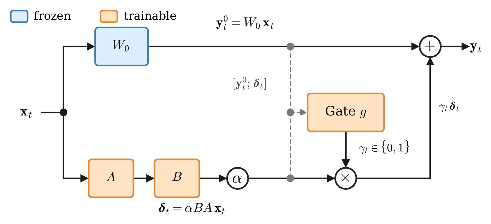

# GaDRA: Learning When Not to Apply LoRA in Replay-Free Continual Pre-Training

[](LICENSE)
[](pyproject.toml)
[](https://github.com/huggingface/peft)
[](https://github.com/GlycerinLOL/GaDRA/actions/workflows/ci.yml)

Official implementation of **GaDRA** (**Ga**ted **D**ual-conditioned **R**esidual **A**dapter), a HuggingFace
[`peft`](https://github.com/huggingface/peft)-native PEFT method that learns *when **not** to apply* a LoRA
update. `import gadra` registers a `"gadra"` method; then use `GaDRAConfig` anywhere you would pass a peft
config. Model-agnostic via `target_modules` name-matching (validated on Llama-3.1-8B-Instruct and Qwen3-8B).
See the [paper](#citation) for the method, results, and analysis.

_Paper under review · `pip install gadra` pending a PyPI release (install from source meanwhile) ·
training/eval data and checkpoints are not redistributed — bring your own._

## Installation

Two entry points — pick one (reproduction already includes the method):

**A · Use the method** — deps `torch`, `transformers==5.7.0`, `peft==0.19.1`, `safetensors`:

```bash
pip install "git+https://github.com/GlycerinLOL/GaDRA.git"   # `pip install gadra` once released on PyPI
```

**B · Reproduce the paper** — clone + [uv](https://docs.astral.sh/uv/); `uv sync` installs the method (editable)
plus the reproduction tooling, covering single- and multi-GPU:

```bash
curl -LsSf https://astral.sh/uv/install.sh | sh        # one-time; uv fetches CPython 3.12 per .python-version
git clone https://github.com/GlycerinLOL/GaDRA && cd GaDRA
uv sync --group gpu --locked                           # cu124 torch + prebuilt flash-attn + deepspeed
uv run huggingface-cli login                           # gated base model
```

Host prerequisites uv cannot install: NVIDIA driver ≥ 525.60.13 (the CUDA 12.4 runtime ships in the torch
wheel), Linux x86_64. Install issues: [FAQ](docs/FAQ.md).

## Quick start

```python
# Importing gadra registers the "gadra" PEFT method; use GaDRAConfig like any peft config.
import gadra
from gadra import GaDRAConfig
from peft import get_peft_model
from transformers import AutoModelForCausalLM, Trainer

base = AutoModelForCausalLM.from_pretrained("meta-llama/Llama-3.1-8B-Instruct")
config = GaDRAConfig(
    r=512, lora_alpha=512, lora_dropout=0.05,
    target_modules=["up_proj", "gate_proj", "down_proj"],
    router_conditioning="dual", gate="hard", task_type="CAUSAL_LM",
)
model = get_peft_model(base, config)
Trainer(model=model, args=..., train_dataset=...).train()
model.save_pretrained("out/")
```

GaDRA is **non-mergeable** (the gate is per-token and input-dependent), so load with the standard peft API and
keep the adapter attached:

```python
from peft import PeftModel
model = PeftModel.from_pretrained(base, "out/")
model.generate(...)
```

## Method

<p align="center">
  
</p>

GaDRA adds a per-position hard gate `γₜ ∈ {0,1}` over the LoRA residual, so an adapted module outputs
`yₜ = yₜ⁰ + γₜ·δₜ`. The gate is **dual-conditioned** on the frozen base output `yₜ⁰` and the candidate residual
`δₜ`, trained jointly with the LoRA factors via a Gumbel straight-through estimator (deterministic
`1[σ(z) > 0.5]` at inference). When the gate closes, the output is bit-identical to the frozen base — GaDRA
leaves prior behavior untouched where the update is not needed. See the [paper](#citation) for the derivation,
results, and analysis, and [`docs/DESIGN.md`](docs/DESIGN.md) for the forward pass.

| Variant | `router_conditioning` | `gate` |
|---|---|---|
| **GaDRA** | `dual` | `hard` |
| GaDRA-Mono | `mono` | `hard` |
| GaDRA-Soft | `dual` | `soft` |
| GaDRA-Mono-Soft | `mono` | `soft` |

## Reproducing the paper

The reproduction tooling lives under [`examples/`](examples/) (repo-only — never shipped in the wheel) and
reproduces the **Llama-3.1-8B × BBC-News** cell (target `bbcqa`; retention `gsm8k` / `mbpp` / `tiebe`). No data
is shipped — supply your own JSONL; [`data/README.md`](data/README.md) lists the formats and where files go.

```bash
# Train — single GPU; the adapter is the config's method: field (gadra | gadra-mono | gadra-soft | lora)
uv run python -m examples.train --config examples/config/train.yaml

# Evaluate — deterministic, no key (task: qa | gsm8k | mbpp; MBPP needs HF_ALLOW_CODE_EVAL=1)
uv run python -m examples.inference --config examples/config/inference.yaml
```

Multi-GPU (accelerate + DeepSpeed), GPT-judged eval (`bbcqa` / `tiebe`), SLURM, and config overrides:
[`examples/README.md`](examples/README.md).

## Repository structure

```text
src/gadra/         pip-installable PEFT tuner (the method; zero data/eval deps)
examples/          repo-only reproduction tooling (NOT shipped in the wheel)
  config/          train / inference / DeepSpeed configs
  slurm/           SLURM wrappers
tests/             package tests
examples/tests/    reproduction-tooling tests
docs/              DESIGN.md (architecture) + FAQ.md
data/              your JSONL inputs (gitignored; see data/README.md)
```

## Citation

If you use GaDRA, please cite the paper (machine-readable metadata in [`CITATION.cff`](CITATION.cff); GitHub's
"Cite this repository" renders it). The paper is under review — the full citation will be added on publication.

```bibtex
@misc{gadra2026,
  title  = {GaDRA: Learning When Not to Apply LoRA in Replay-Free Continual Pre-Training},
  year   = {2026},
  note   = {Code: https://github.com/GlycerinLOL/GaDRA}
}
```

## Contributing

Issues and PRs welcome — see [`CONTRIBUTING.md`](CONTRIBUTING.md). The local check CI runs:

```bash
ruff check src tests examples
pytest -q -m "not gpu" tests/
pytest -q -m "not gpu" examples/tests/
uv lock --check
```

Design notes: [`docs/DESIGN.md`](docs/DESIGN.md). Common issues: [`docs/FAQ.md`](docs/FAQ.md).

## Security

The optional MBPP eval executes model-generated code (`HF_ALLOW_CODE_EVAL=1`) — run it only in an isolated
environment. No secrets are stored in the repo; the GPT judge reads `OPENAI_API_KEY` from the environment. See
[`SECURITY.md`](SECURITY.md).

## License

Licensed under the [Apache License 2.0](LICENSE).
